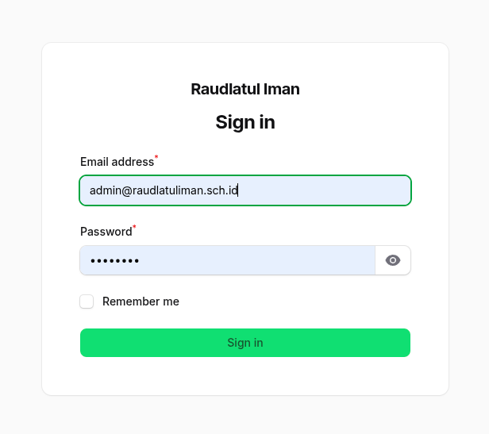
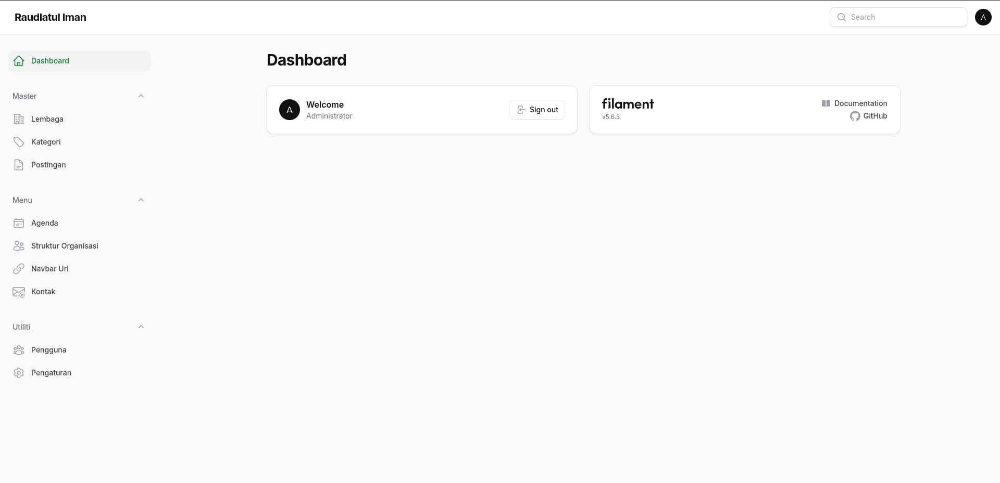
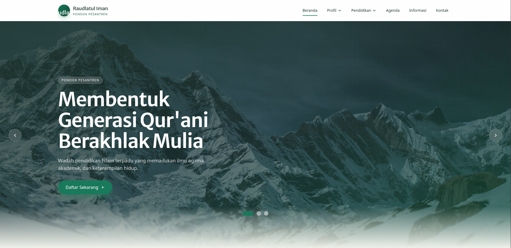
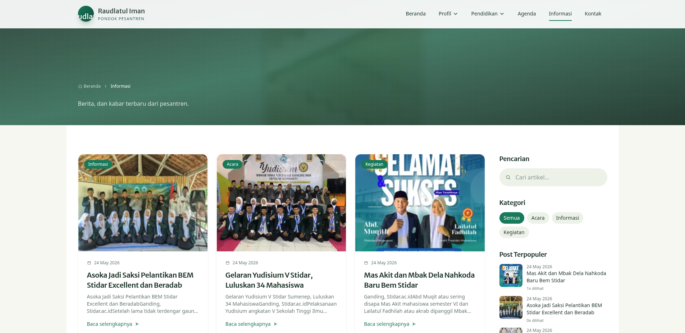
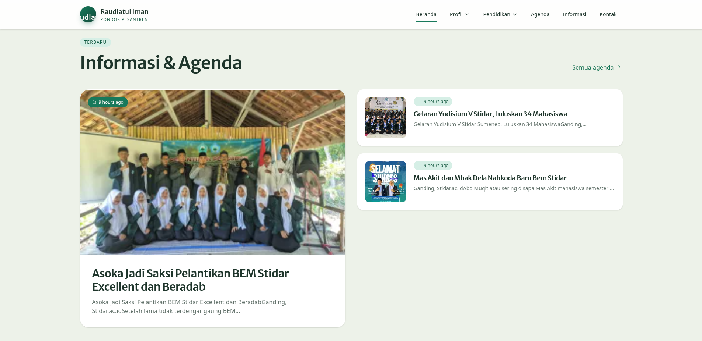
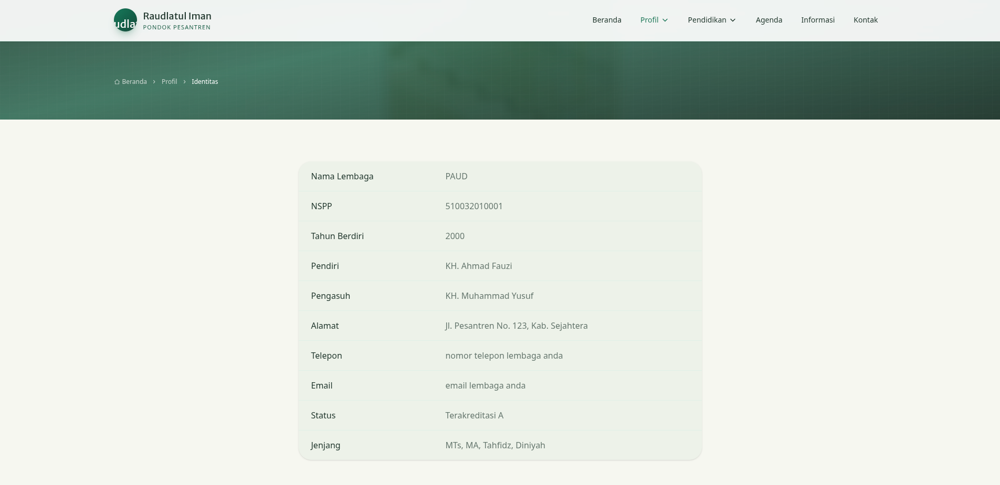
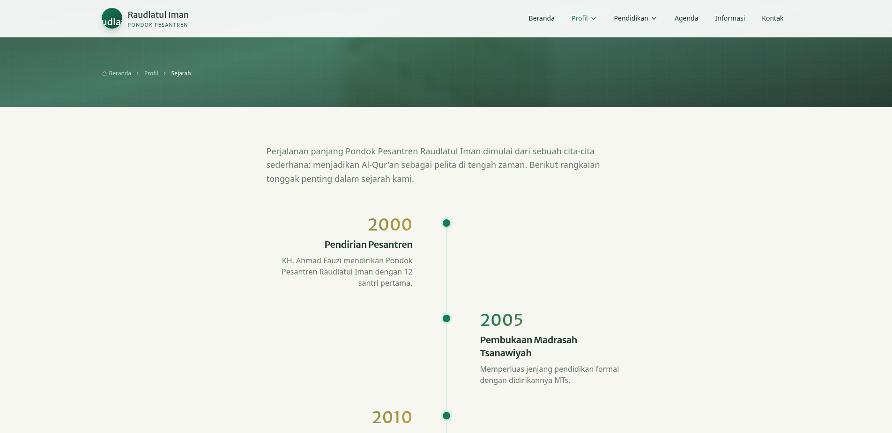

# Pondok Pesantren Raudlatul Iman

Aplikasi website resmi Pondok Pesantren Raudlatul Iman dibangun dengan Laravel, Livewire, Tailwind CSS, dan Filament untuk kebutuhan publik dan administrasi.

## Requirements

- PHP 8.4
- Composer 2.9.8
- Node.js v22.22.3
- Laravel 13.9.0
- Livewire 4.3.0
- Filament 5.6.3
- Database: MariaDB

## Fitur Halaman Utama

- Hero carousel dengan CTA pendaftaran
- Seksi sambutan dan profil pesantren
- Statistik ringkas lembaga
- Program pendidikan unggulan
- Informasi dan agenda terbaru
- Galeri momen pesantren
- Testimoni santri dan wali santri
- CTA pendaftaran santri baru
- Halaman profil, sejarah, dan identitas lembaga
- Halaman informasi artikel dengan pencarian dan kategori

## Fitur Admin

- Login panel admin melalui Filament
- Kelola lembaga
- Kelola kategori
- Kelola postingan dan konten informasi
- Kelola agenda
- Kelola struktur organisasi
- Kelola navbar URL
- Kelola kontak
- Kelola pengguna
- Kelola pengaturan situs

## Cara Install

1. Clone atau download project ini.
2. Masuk ke direktori project.
3. Jalankan dependency backend.
4. Duplikat file `.env.example` menjadi `.env`.
5. Update database yang digunakan di `.env`.
6. Update `APP_NAME` dengan nama yang dibutuhkan.
7. Jalankan migrasi, seed, dan siapkan storage.
8. Install dependency frontend, lalu build asset.

```bash
composer install

cp .env.example .env

php artisan key:generate
php artisan migrate --seed
php artisan storage:link
php artisan optimize:clear
php artisan optimize

npm install
npm run build
```

## Menjalankan Aplikasi

Untuk development, jalankan salah satu perintah berikut:

```bash
php artisan serve
```

atau

```bash
composer run dev
```

Lalu buka:

```text
http://127.0.0.1:8000
```

## Akses Admin

Buka panel admin di:

```text
http://127.0.0.1:8000/admin
```

Login menggunakan:

- Email: `admin@raudlatuliman.sch.id`
- Password: `password`

## Preview

Preview halaman tersedia di folder `public/images/preview`.

### Login



### Dashboard Admin



### Beranda



### Informasi



### Informasi & Agenda



### Identitas



### Sejarah



## Lisensi

Proyek ini tidak menggunakan lisensi open source. Hak penggunaan mengikuti ketentuan internal proyek.